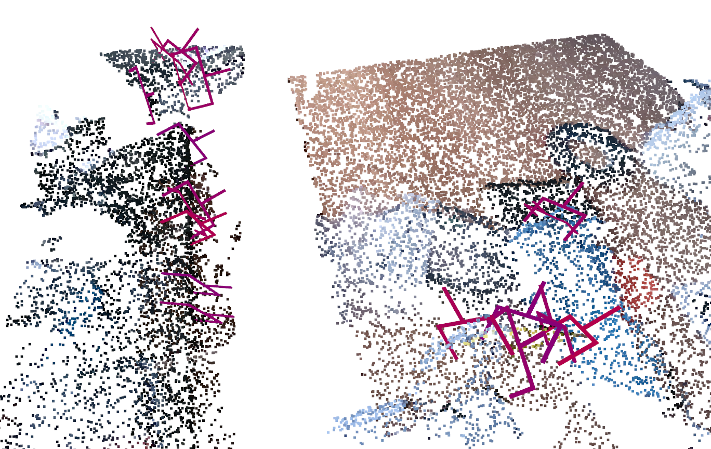
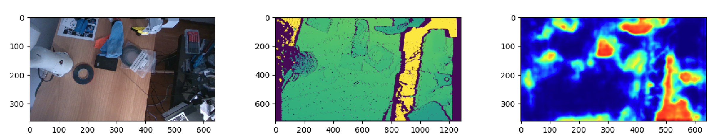

# OpenGrasp

**Apache-2.0 licensed Vision-to-Grasp engine for professional robot assistants and autonomous laboratories.**

OpenGrasp provides high-speed 6-DoF grasp pose prediction for unknown objects, designed for production integration without restrictive licensing or per-site engineering.

<p align="center">
  
  <br />
  
</p>

---

## Current Status

**TRL 4.** Functional laboratory pipeline operational on a Franka Research 3 arm with parallel-jaw gripper and Intel RealSense RGB-D sensing. The software scaffold, evaluation protocol, and data-generation pipeline are defined.

Active development is underway toward a packaged, benchmarked v1.0 release — including industrial feasibility filtering and towards adaptive grasp learning.

---

## Installation

Clone the project and initialize git submodules:

```bash
git clone <REPO_URL>
cd OpenGrasp
git submodule update --init --recursive
```

Create a Python 3.10 environment (micromamba) and activate it:

```bash
micromamba create -n open-grasp python=3.10
micromamba activate open-grasp
```

Install PyTorch (CUDA 11.3, PyTorch 1.11.0):

```bash
pip install torch==1.11.0+cu113 torchvision==0.12.0+cu113 torchaudio==0.11.0 \
  --extra-index-url https://download.pytorch.org/whl/cu113
```

Install PyTorch3D:

```bash
pip install fvcore
pip install --no-cache-dir pytorch3d \
  -f https://dl.fbaipublicfiles.com/pytorch3d/packaging/wheels/py310_cu113_pyt1110/download.html
```

Install remaining dependencies:

```bash
pip install -r requirements.txt
```

---

## Run

From the repo root (with the environment activated):

```bash
python run.py
```

---

## Hardware

Developed and validated on:
- Franka Research 3 collaborative robot arm
- Weiss WSG-50 parallel-jaw gripper
- Intel RealSense D-series RGB-D cameras
- NVIDIA Jetson Orin Nano (edge inference target)

---

## License

Licensed under the [Apache License 2.0](LICENSE). Weights trained exclusively on synthetic and project-generated data — clean for commercial integration.

---

## Citation

If you use OpenGrasp in your research, please cite this repository. A technical paper is in preparation.